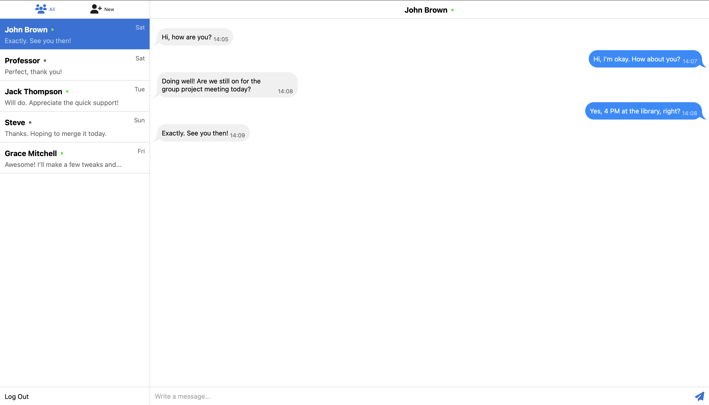

# Chat Application Frontend Project

This repository contains the frontend-only part of a chat application, built using HTML, CSS, and JavaScript. It features a sidebar with two toggleable modes ("All" and "New") for displaying user lists, and a main chat window where users can type and send messages.

## Features

- **User Sidebar**: Switch between "All" users and "New" users.
- **Chat Window**: Enter and send messages in a conversational interface.
- **Responsive Design**: Clean and simple layout optimized for modern browsers.

## UI Preview

Below is a visual representation of the chat interface:

> [!NOTE]
>
> This project is not deployed online and runs locally on `localhost`.

## Author

Created by [Denys Bondarchuk](https://github.com/profjuvii). Feel free to reach out or contribute to the project!